# מדריך למשתמש – מערכת ניהול מערכת השיבוצים

## תוכן עניינים

1. [מבוא](#מבוא)
2. [כניסה למערכת](#כניסה-למערכת)
3. [ניווט כללי במערכת](#ניווט-כללי-במערכת)
4. [דף הבית](#דף-הבית)
5. [שיבוץ מ"מ](#שיבוץ-ממ)
6. [מערכת חלופית (טיוטה)](#מערכת-חלופית-טיוטה)
7. [שיבוץ צוות קבוע בכיתות](#שיבוץ-צוות-קבוע-בכיתות)
8. [מערכות עזר](#מערכות-עזר)
9. [דוח לעובדת](#דוח-לעובדת)
10. [קייטנות](#קייטנות)
11. [היסטוריה](#היסטוריה)
12. [ניהול – הגדרות, עובדות, כיתות](#ניהול)
13. [ניהול משתמשים](#ניהול-משתמשים)
14. [ניהול מערכת (מנהל על)](#ניהול-מערכת-מנהל-על)
15. [ייבוא וייצוא נתונים](#ייבוא-וייצוא-נתונים)
16. [רכיבים ופעולות נפוצות](#רכיבים-ופעולות-נפוצות)
17. [שאלות נפוצות ופתרון בעיות](#שאלות-נפוצות-ופתרון-בעיות)

---

## מבוא

מערכת השיבוצים מיועדת לניהול מערכת השעות והצוות בכיתות ובמערכות עזר בבית הספר: שיבוץ עובדות קבועות, מילוי מקום (מ"מ) בזמן היעדרויות, ניהול קייטנות, מעקב היסטוריה, וניהול משתמשים והרשאות.

### רמות הרשאה במערכת

| סוג הרשאה | משמעות |
|---|---|
| **הרשאה מלאה** | אפשרות לצפות, ליצור, לערוך ולמחוק נתונים |
| **צפייה בלבד** | אפשרות לצפות בנתונים בלבד, ללא עריכה |
| **מנהל/ת בית ספר** (`is_school_admin`) | בנוסף להרשאות רגילות – ניהול משתמשי בית הספר (הזמנה, שינוי הרשאות) |
| **מנהל/ת מערכת** (`is_system_admin`) | גישה מלאה לכל בתי הספר במערכת, ניהול הגדרות גלובליות ופניות משתמשים |

רמת ההרשאה שלך מוצגת בתחתית התפריט הצדדי.

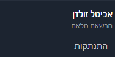

---

## כניסה למערכת

1. גשו לכתובת המערכת בדפדפן.
2. הזינו כתובת מייל וסיסמה.
3. במקרה של שכחת סיסמה – לחצו על "שכחתי סיסמה" ועקבו אחר ההוראות לאיפוס.

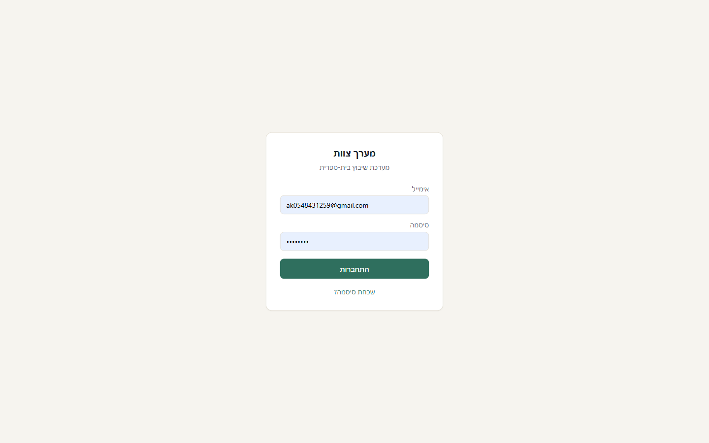

> המערכת מתנתקת אוטומטית לאחר פרק זמן של חוסר פעילות (הזמן נקבע על ידי מנהל המערכת).

---

## ניווט כללי במערכת

בצד המסך (בעברית – מימין) נמצא **התפריט הראשי**, ובראש כל עמוד נמצא **כפתור הייצוא**.

### התפריט הראשי (Sidebar)

קבוצת הפעולות היומיומיות:
- דף הבית
- שיבוץ מ"מ
- מערכת חלופית
- מערכות עזר
- דוח לעובדת
- שיבוץ צוות קבוע בכיתות
- קייטנות
- היסטוריה

קבוצת **ניהול**:
- הגדרות
- עובדות
- כיתות

בהתאם להרשאות, יתווספו גם:
- ניהול משתמשים (למנהלי בית ספר)
- ניהול מערכת ופניות משתמשים (למנהלי מערכת)

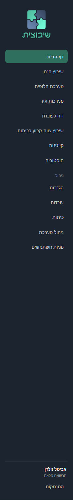

### כפתור ייצוא

בראש כל עמוד קיים כפתור **ייצוא** עם שתי אפשרויות:
- **PDF (הדפסה)** – פותח את חלון ההדפסה של הדפדפן להפקת PDF של המסך הנוכחי.
- **Excel** – מוריד קובץ CSV עם נתוני הטבלה המוצגת על המסך (ניתן לפתוח באקסל).

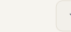

### יציאה מהמערכת

בתחתית התפריט הצדדי, לחצו על כפתור ההתנתקות.

---

## דף הבית

דף הבית מציג את מערכת השעות היומית/שבועית לכל הכיתות.

עיקרי הפעולות:
- **מעבר בין תצוגת יום לתצוגת שבוע.**
- **ניווט בין תאריכים** – חצים קדימה/אחורה, כפתור "היום", ובורר תאריך ישיר.
- **סינון לפי כיתה** – הצגת כיתה בודדת או כלל הכיתות.
- **התראת חופשות** – באנר עליון שמתריע על עובדות בחופשה בטווח התאריכים המוצג.
- **פאנל "חוסרים במערכות עזר"** – ניתן לצפות ולשבץ ישירות מתוך הפאנל הזה.
- **שיבוץ ישיר בתא** – לחיצה על תא בטבלה מאפשרת לשבץ עובדת או לסמן היעדרות.

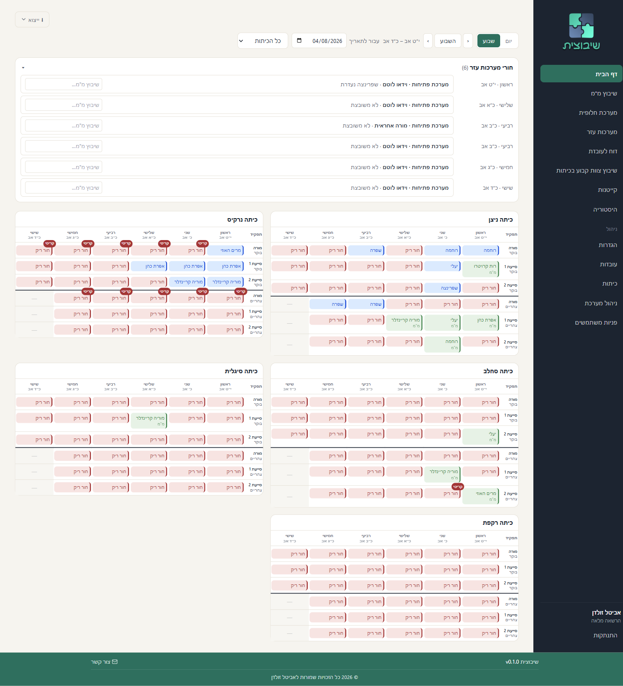

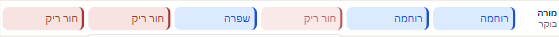

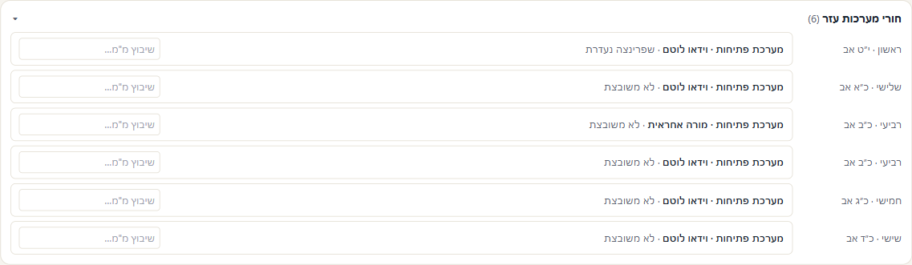

---

## שיבוץ מ"מ

מסך ייעודי לאיתור ומילוי חוסרים (מילוי מקום) – מרוכז את כל השיבוצים החסרים בלבד, כדי לאפשר טיפול מהיר.

- מעבר בין תצוגת יום/שבוע.
- מעבר בין תצוגה **לפי כיתה** לתצוגה **לפי חלק יום** (בוקר/צהריים).
- שיבוץ מ"מ ישירות מתוך הרשימה.

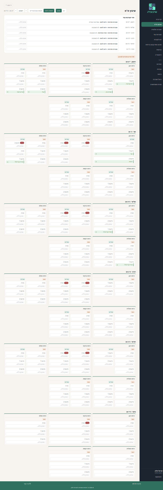

---

## מערכת חלופית (טיוטה)

מאפשר לבנות **טיוטת** מערכת שבועית קבועה לכיתה, לבדוק ולערוך אותה מבלי להשפיע על המערכת החיה, ולאחר מכן להחיל אותה.

שלבי עבודה מומלצים:
1. בחרו כיתה.
2. ערכו את השיבוץ השבועי בטיוטה (גרירה/לחיצה על תאים בטבלה השבועית).
3. לחצו **החל** כדי להעביר את הטיוטה למערכת החיה – מיידית או החל מתאריך מסוים ועד תאריך מסוים (טווח תוקף).
4. ניתן גם **לבטל את הטיוטה** אם אינה נדרשת עוד.

המערכת בודקת התנגשויות שיבוץ מול כיתות אחרות בטרם ההחלה.

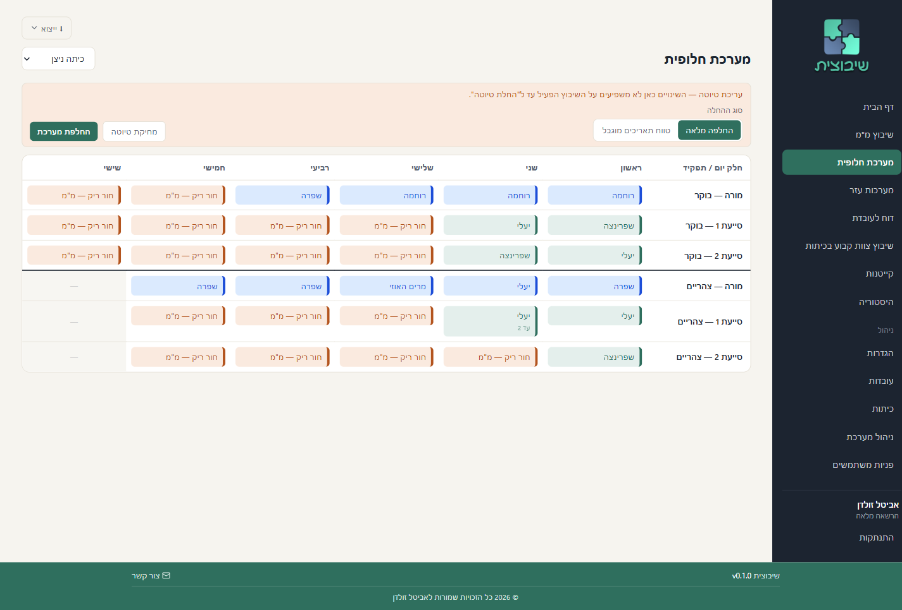

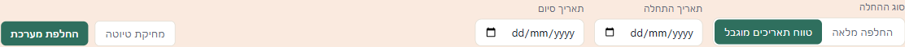

---

## שיבוץ צוות קבוע בכיתות

עריכת המערכת השבועית **הקבועה/החיה** של כל כיתה (לא טיוטה).

- הוספת/עריכת שיבוצי בסיס לפי יום ותפקיד.
- ניקוי שיבוצים כפולים.
- בדיקת התנגשויות מול כיתות אחרות.

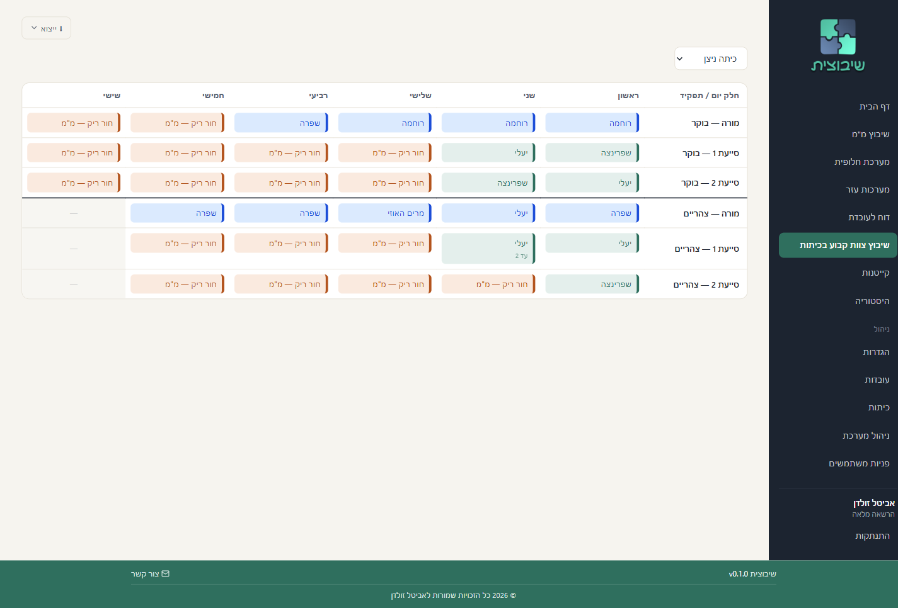

---

## מערכות עזר

ניהול "מערכות עזר" – למשל תורנויות פתיחה/סגירה, שאינן קשורות לכיתה ספציפית.

עיקרי הפעולות:
- יצירת מערכת עזר חדשה (שם, חלק היום שהיא שואבת ממנו – בוקר/צהריים/הכול, והאם להציג אותה ברשימת החוסרים).
- הגדרת תפקידים בתוך מערכת העזר.
- שיבוץ שבועי לפי יום, כאשר ניתן לבחור רק מתוך עובדות שכבר משובצות באותו יום.

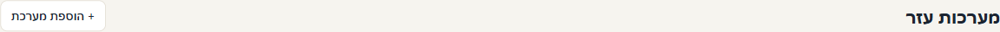

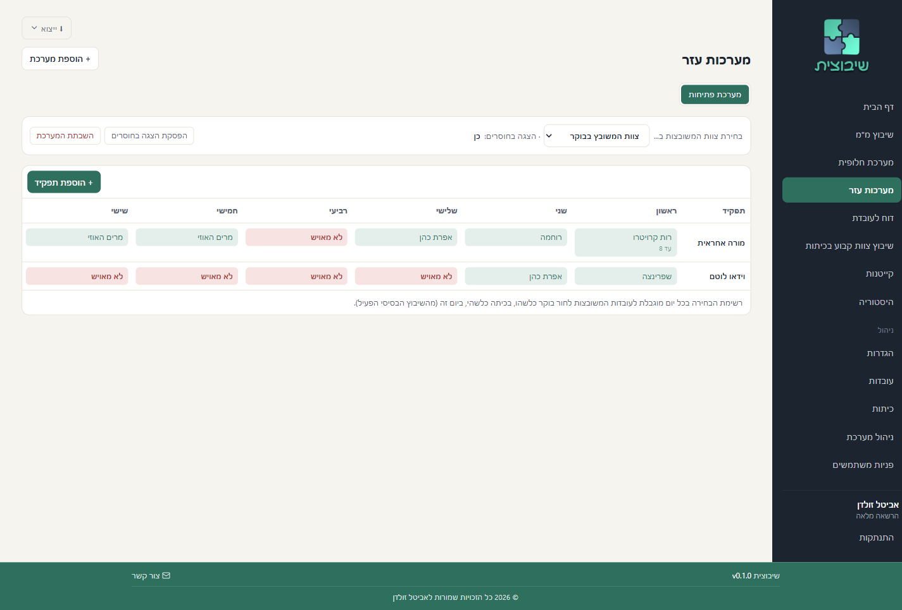

---

## דוח לעובדת

הפקת דוח אישי לעובדת עבור טווח תאריכים נבחר – מציג את כל השיבוצים שלה לפי יום, כיתה וחלק יום.

- בחרו עובדת.
- בחרו טווח תאריכים.
- ניתן להציג/להסתיר את עמודת הכיתה בדוח.

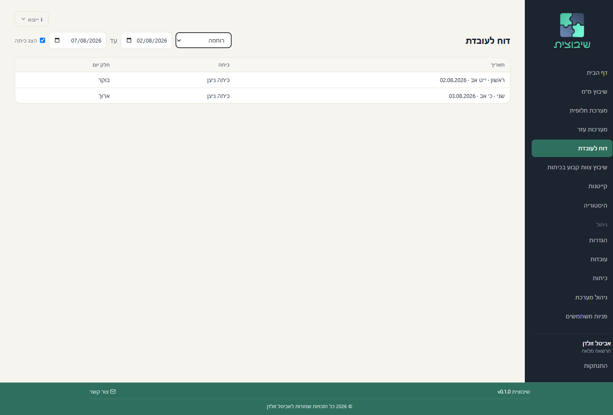

---

## קייטנות

ניהול תוכניות קיץ/חופשה (קייטנות).

- **רשימת קייטנות** – מציגה סטטוס לכל קייטנה: עתידית / פעילה / הסתיימה.
- **יצירת קייטנה** – שם וטווח תאריכים. (לא ניתן למחוק קייטנה – רק להשבית, כדי לשמר היסטוריה.)
- **מסך קייטנה בודדת** – מערכת שיבוצים בסגנון דף הבית, ממוקדת לתקופת הקייטנה בלבד, כולל ניהול תורנות פתיחה עבורה.

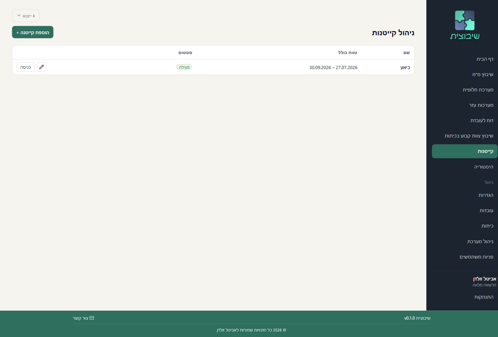

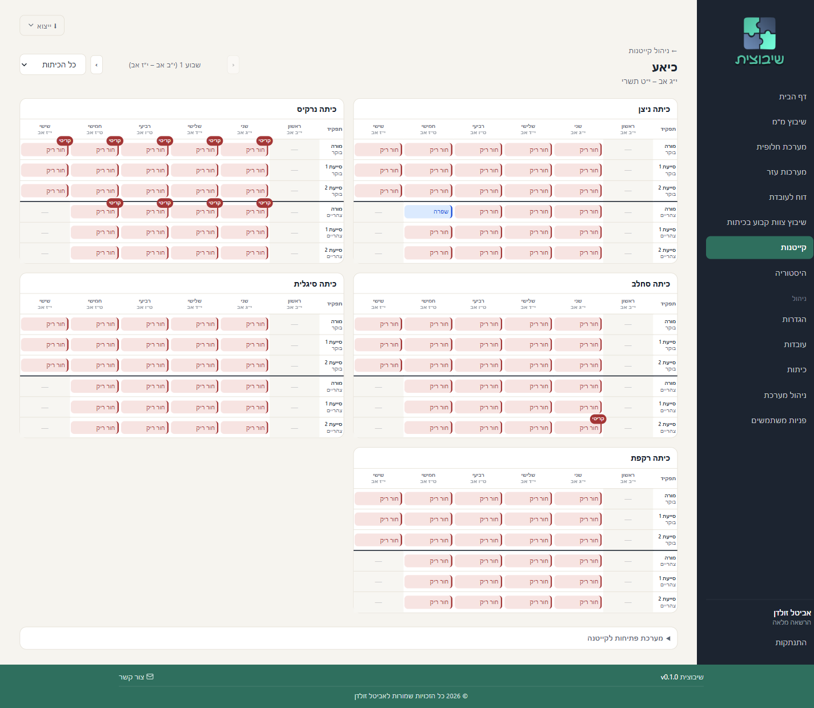

---

## היסטוריה

יומן ביקורת (Audit Log) של כל השינויים בשיבוצים ובסימוני היעדרות – מי ביצע, מה בוצע, מתי.

- ברירת מחדל: 30 הימים האחרונים, עם אפשרות לבחור טווח תאריכים אחר.
- סינון לפי תאריך, כיתה, סוג פעולה, פרטים ומשתמש (לחצן הסינון ⚲ בראש כל עמודה).
- דפדוף בין עמודים (Pagination).

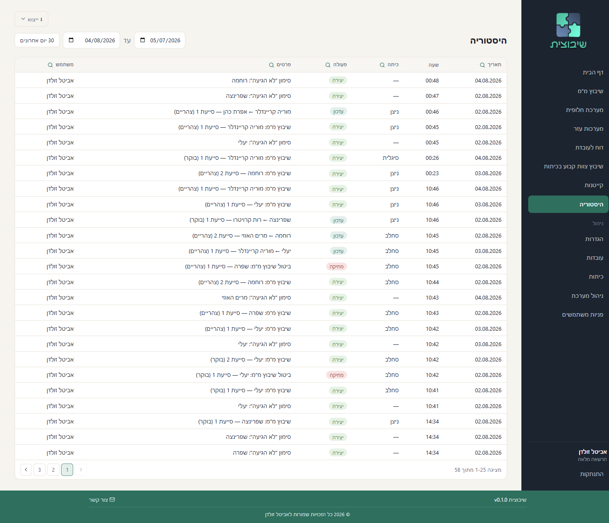

---

## ניהול

קבוצת "ניהול" בתפריט כוללת שלושה מסכים.

### הגדרות

- תצוגת ברירת מחדל בדף הבית (יום/שבוע).
- פורמט הצגת תאריכים (עברי/לועזי/שניהם).
- ניהול חגים ומועדים – הוספה ידנית או ייבוא מקובץ CSV.
- ניהול קטגוריות עובדות (כולל צבע לכל קטגוריה).
- ניהול סוגי תפקידים ומספר בעלי התפקיד המוגדר כברירת מחדל לכל כיתה (בוקר/צהריים).
- כפתור **"פתיחת שנה חדשה"**.

> עבור משתמשי צפייה בלבד, כל פקדי העריכה במסך זה מושבתים.

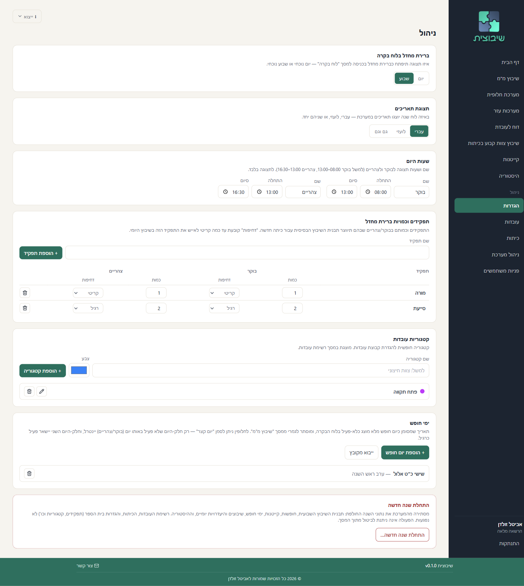

### עובדות

- טבלת עובדות עם סינון לפי עמודה (שם, תפקיד, קטגוריה, סטטוס, שעות, טלפון, מייל, הערות) ודפדוף.
- הוספה/עריכה של עובדת (חלון קופץ).
- הפעלה/השבתה של עובדת.
- הצגה/הסתרה של עובדות לא פעילות.
- הוספה וניהול חופשות לעובדת ([ראו הרחבה למטה](#חלון-ניהול-חופשה)).
- ייבוא עובדות בכמות מקובץ CSV.
- התראה במקרה של שם כפול (גם בהוספה ידנית וגם בייבוא).

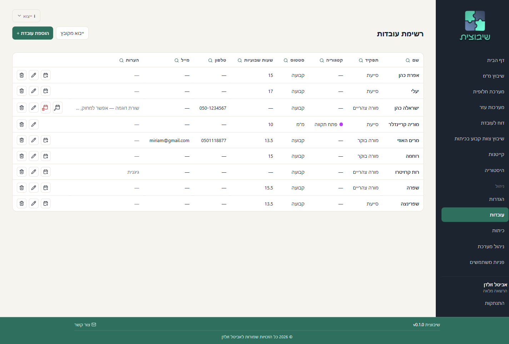

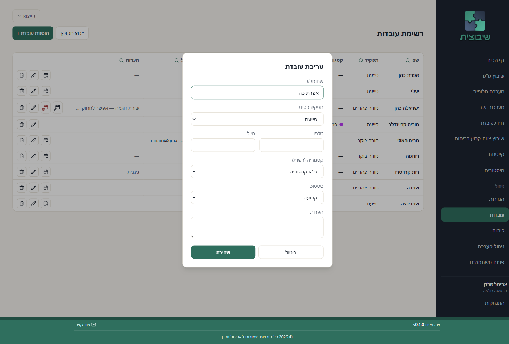

### כיתות

- טבלת כיתות עם תגית סטטוס: **הושלם** / **חלקי** / **טרם הוגדר** (בהתאם למילוי התפקידים המוגדרים כברירת מחדל).
- יצירה/עריכה של שם כיתה.
- הפעלה/השבתה של כיתה.
- קישור ישיר למסך "שיבוץ צוות קבוע" של הכיתה.

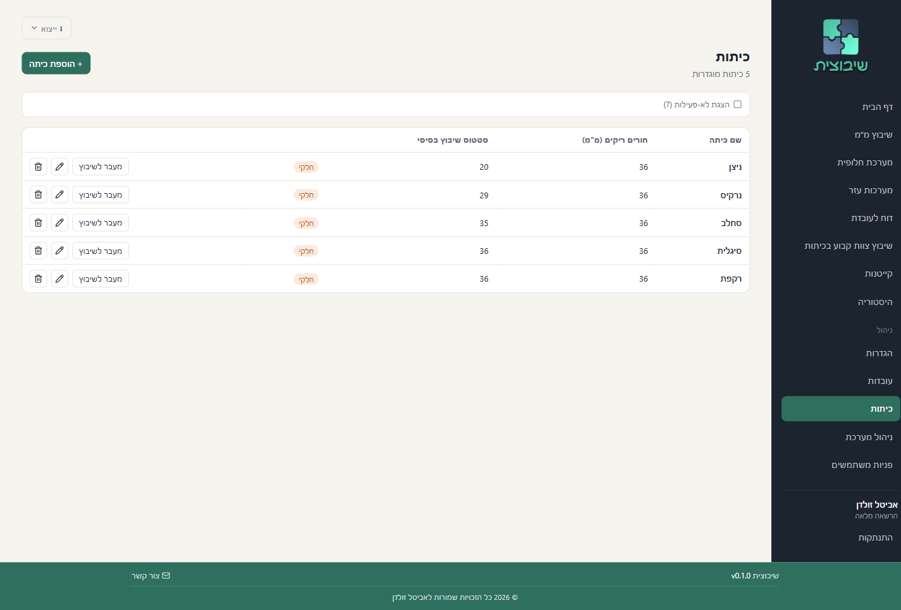

---

## ניהול משתמשים

*(מוצג רק למנהלות/י בית ספר)*

מסך לניהול המשתמשים בבית הספר שלכם בלבד:
- הזמנת משתמש/ת חדש/ה (מייל, שם, רמת הרשאה).
- שינוי רמת הרשאה (מלאה/צפייה בלבד) והפעלה/השבתה של משתמש קיים.
- לא ניתן לערוך משתמשי מנהל אחרים דרך מסך זה.

> מספר המשתמשים בעלי הרשאה מלאה מוגבל למכסה שנקבעה לבית הספר על ידי מנהל המערכת.

---

## ניהול מערכת (מנהל על)

*(מוצג רק למנהלי מערכת – `is_system_admin`)*

מסך עם שלושה טאבים:

1. **בתי ספר** – יצירת בית ספר חדש, הפעלה/השבתה, וקביעת מכסת המשתמשים בעלי הרשאה מלאה.
2. **משתמשים** – ניהול משתמשים בכל בתי הספר במערכת (לא רק בית ספר אחד).
3. **הגדרות** – הגדרת זמן ניתוק אוטומטי (Idle Logout) גלובלי לכלל המערכת.

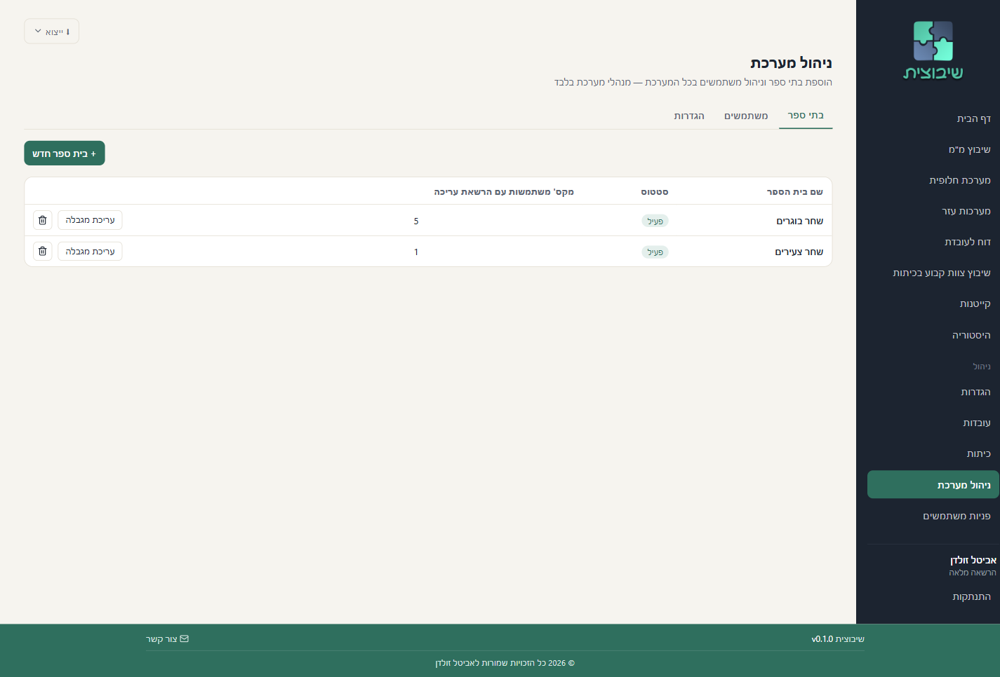

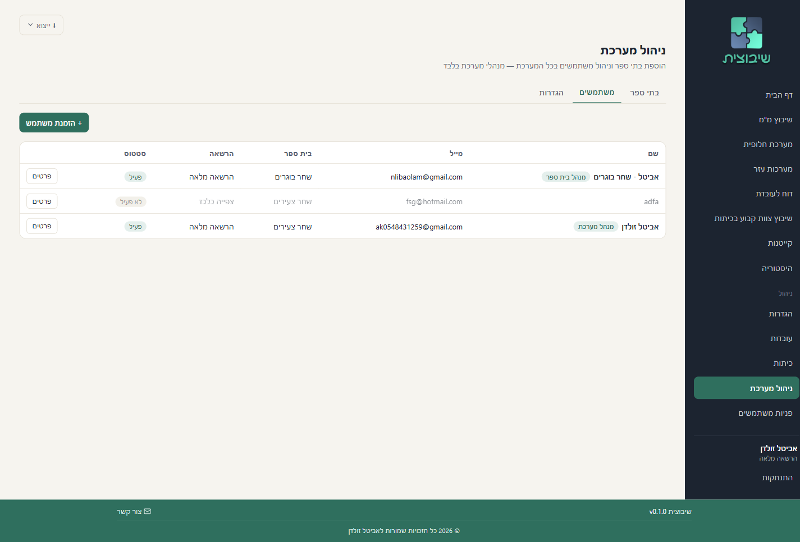

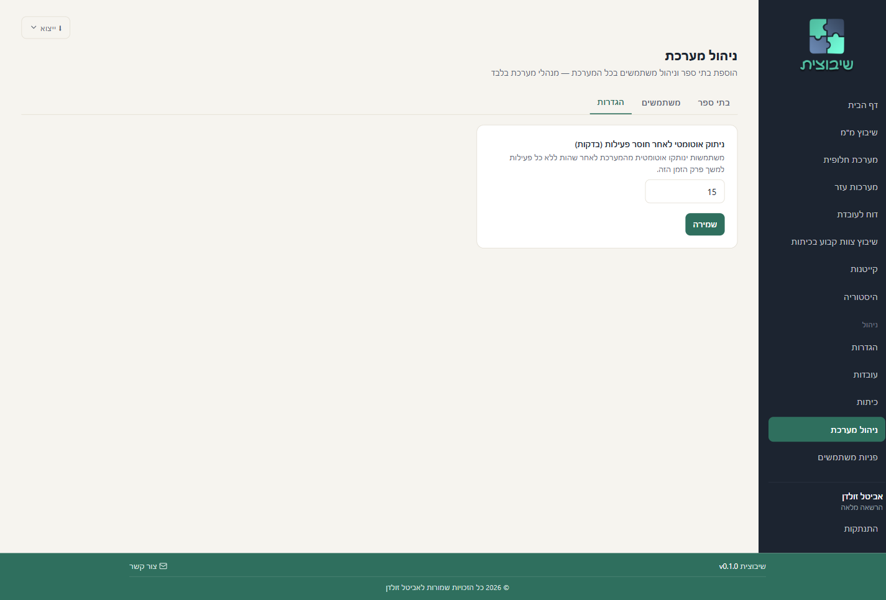

### פניות משתמשים

תיבת דואר נכנס לפניות שהתקבלו מטופס "צור קשר" בתחתית האתר: סטטוס (חדש/נצפה/טופל), סינון, וסימון כטופל.

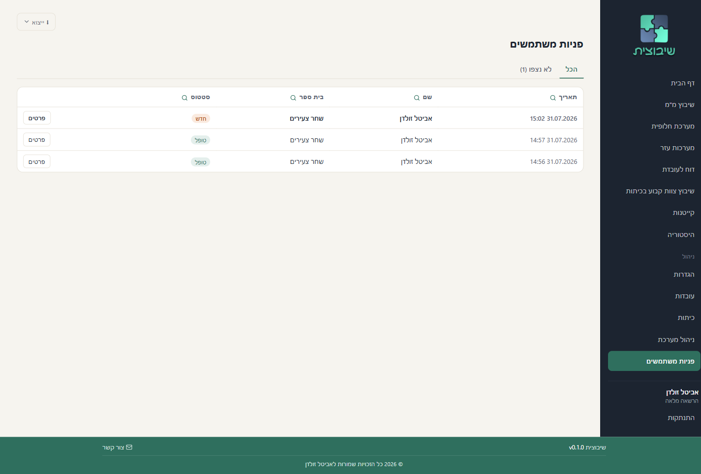

---

## ייבוא וייצוא נתונים

### ייבוא עובדות

1. בעמוד **עובדות**, פתחו את חלון הייבוא.
2. הורידו את קובץ התבנית (עמודות: שם מלא, תפקיד בסיס, סטטוס, טלפון, מייל, הערות).
3. מלאו את הקובץ ושמרו כ־CSV.
4. העלו את הקובץ למערכת – תוצג תצוגה מקדימה עם בדיקת שגיאות לכל שורה (למשל תפקיד לא תקין, שם כפול).
5. אשרו את הייבוא.

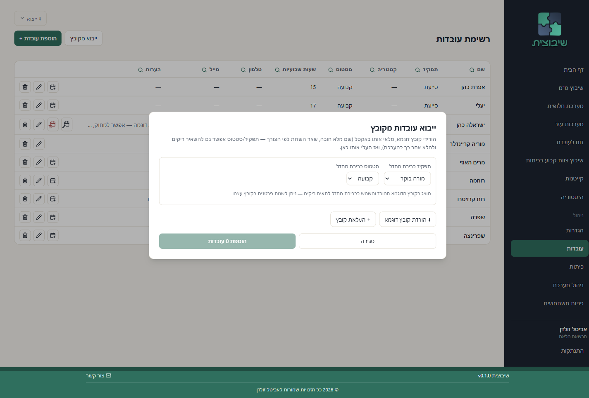

### ייבוא חגים

באופן דומה, מעמוד **הגדרות**: הורדת תבנית, מילוי (תאריך, תיאור, סוג – יום שלם/חצי יום), והעלאה.

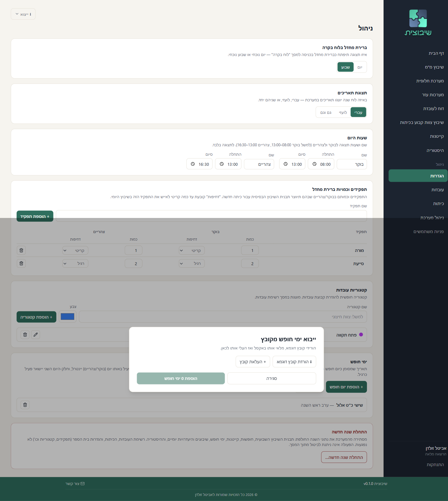

### ייצוא

בכל עמוד, כפתור **ייצוא** בראש המסך מאפשר הפקת PDF (הדפסה) או הורדת הנתונים המוצגים כקובץ Excel/CSV.

---

## רכיבים ופעולות נפוצות

### סינון עמודות בטבלאות

בראש כל עמודה ניתן ללחוץ על סמל הזכוכית המגדלת ⚲ לפתיחת חלון סינון – חיפוש חופשי ו/או בחירה מרשימת ערכים אפשריים.

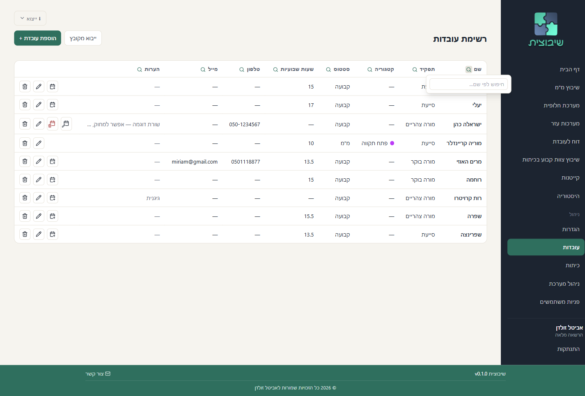

### דפדוף (Pagination)

בתחתית טבלאות ארוכות מוצג פס דפדוף עם מספר העמוד וטווח הרשומות המוצגות מתוך הסך הכול.

### כרטיס מידע מהיר על עובדת

מעבר עם העכבר מעל שם עובדת בטבלאות שונות מציג כרטיסון מידע מהיר, עם קישור לכרטיס המלא שלה בעמוד העובדות.

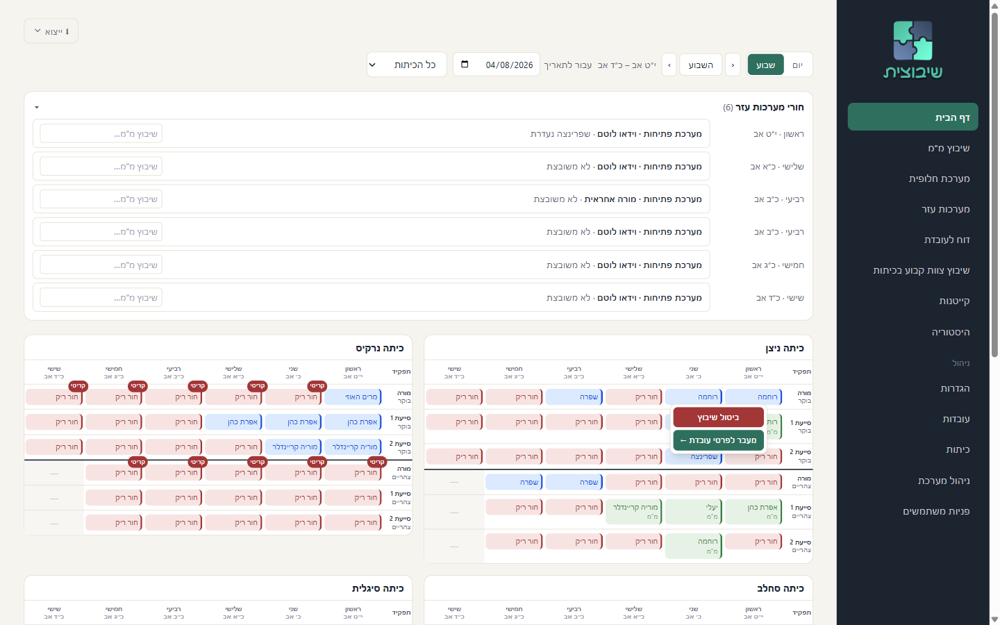

### חלון ניהול חופשה

בעמוד עובדות, ניתן להוסיף/לערוך חופשה לעובדת:
- בחירת טווח תאריכים.
- הגדרת תזכורות (3/7/14 ימים מראש).
- שיבוץ מ"מ חלופי לכל יום/משמרת בזמן החופשה.

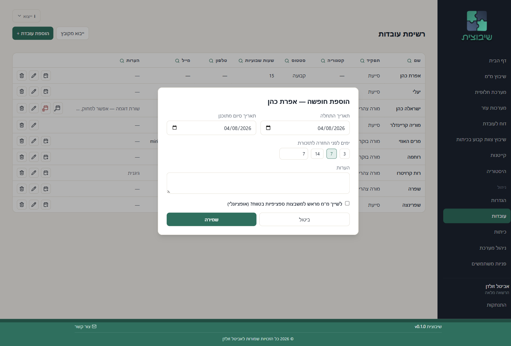

### חלונות אישור פעולה

לפני פעולות משמעותיות (השבתת עובדת, ביטול טיוטה, החלת טיוטה וכו') תוצג בקשת אישור למניעת טעויות.

### טופס יצירת קשר

בתחתית כל עמוד קיים קישור "צור קשר" לשליחת פנייה לצוות התמיכה/מנהלי המערכת.

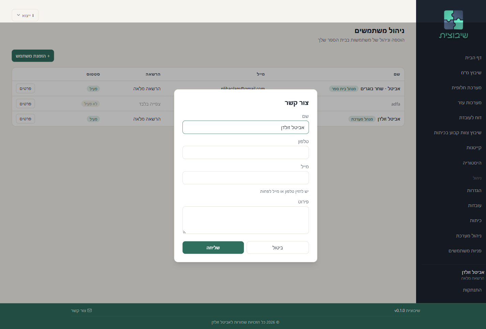

---

## שאלות נפוצות ופתרון בעיות

**אני לא רואה כפתורי עריכה / הכל אפור**
ככל הנראה רמת ההרשאה שלכם היא "צפייה בלבד". פנו למנהל/ת בית הספר לשינוי ההרשאה.

**התנתקתי לבד מהמערכת**
המערכת מתנתקת אוטומטית לאחר זמן חוסר פעילות שנקבע מראש, מטעמי אבטחה.

**קובץ ה־CSV שהעליתי נדחה**
ודאו שהעמודות תואמות בדיוק לתבנית שהורדתם, ושאין תווים מיוחדים או שורות ריקות. שימו לב להודעות השגיאה ליד כל שורה בתצוגה המקדימה.

**אני לא רואה את תפריט "ניהול מערכת"**
תפריט זה מוצג רק למשתמשים עם הרשאת מנהל מערכת (`is_system_admin`). "ניהול משתמשים" מוצג למנהלי בית ספר בלבד.

**מה ההבדל בין "מערכת חלופית" ל"שיבוץ צוות קבוע"?**
"מערכת חלופית" היא טיוטה שניתן לערוך ולבדוק בלי להשפיע על המערכת החיה, ולהחיל אותה מאוחר יותר (מיידית או בטווח תאריכים). "שיבוץ צוות קבוע בכיתות" עורך ישירות את המערכת הקבועה הפעילה.

---

*מדריך זה מתעדכן מעת לעת בהתאם לשינויים במערכת. לשאלות נוספות ניתן לפנות דרך טופס "צור קשר" בתחתית האתר.*
